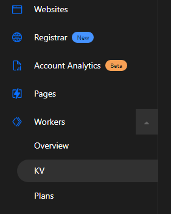

# URL Shortner

A private service that shortens an URL, and redirects to the original URL.

## Benefits

- Suppose you share a URL with someone then in future you realise that it is a wrong URL, and you can not undo the shared one. With this service just change your URL in the storage with letting the receiver know.
- Another benefit of this service is that you add URL for something in a document, and for some reason you have to change the location in your the document, rather than resharing the whole document add URL generated from this service.

## Paths

| **Paths**         | **Description**                                        | **Body Required** | **JSON Keys** |
|------------------|--------------------------------------------------------|-------------------|---------------|
| GET `/urls`       | All URLs with their sharable URL and alias-name(key)   | No                | -             |
| GET `/urls/key`   | Redirects to the URL that is associated with the 'key' | No                | -             |
| POST `/urls`      | To insert a new URL                                    | Yes               | alias, url    |
| POST `/urls/key`  | To edit an existing URL                                | Yes               | url           |
| DELETE `/urls/key` | To delete an existing URL                              | No                | -             |

The service runs using [Cloudflare's Workers](https://workers.cloudflare.com/). To publish your own worker you will need a [Cloudflare account](https://dash.cloudflare.com/).

Follow installation steps from [Cloudflare Docs](https://developers.cloudflare.com/workers/). Once wrangler is installed login to your Cloudflare account with CLI, follow [the docs](https://developers.cloudflare.com/workers/cli-wrangler/authentication).

After login into your account, create a new KV storage namespace. The KV storage is a storage where the data will be stored, where the _key_ is **alias** name for the original link and _value_ is the **url** which is to be shared.

There are two ways to create namespace: [Cloudflare Dashboard](#creating-namespace-using-cloudflare-dashboard) and [CLI](#creating-namespace-using-commandline)

## Creating Namespace Using Cloudflare Dashboard

Open your [Cloudflare Dashboard](https://dash.cloudflare.com/). Then go to **KV** section under **Workers** section.



Create new namespace using `Create namespace` button.

## Creating Namespace Using Commandline

To create namespace using commandline open terminal and type

```text
wrangler kv:namespace create "YOUR_NAMESPACE_NAME"
```

Once a namespace is created, copy namespace id.

Create a `wrangler.toml` file and paste the following:

```toml
name = "url-shortner"
type = "webpack"

account_id = "YOUR_ACC_ID" # Add your account id here...
workers_dev = true
route = ""
zone_id = ""
compatibility_date = "2022-02-02"

webpack_config = "webpack.config.js"

kv_namespaces = [
    { binding = "URLS", id = "NAMESPACE_ID" } # Add namespace id here...
]
```

> Note: It is not mandatory to use the same name in _binding_ as the namespace you created. So, let is be **URLS**

You can run your worker locally using command

```text
wrangler preview
```

To debug it use command

```text
wrangler dev
```

After that publish your worker on Cloudflare with command

```text
wrangler publish
```

Thanks to [Joel Thomas](https://joel.net) for an amazing [tutorial series](https://www.youtube.com/playlist?list=PL59tadyXaIqXkyNIPEgXAZqeyPgQjxxM3) on cloudflare workers.
